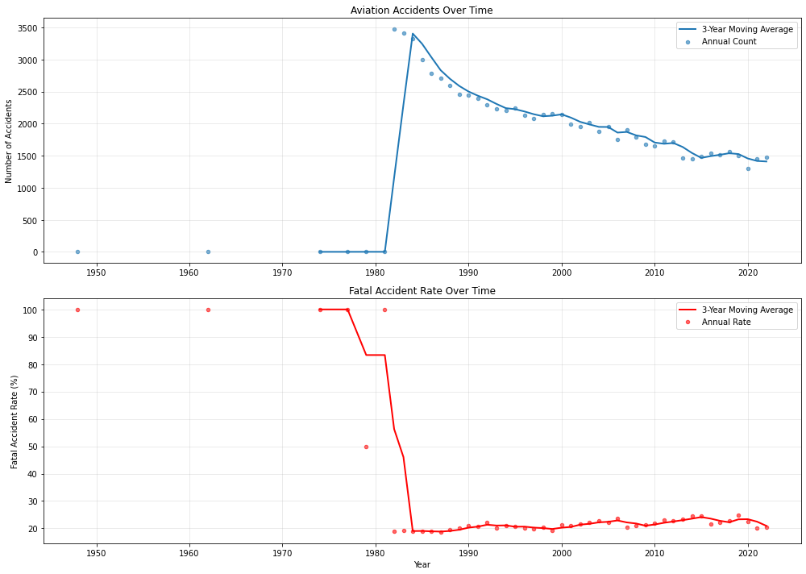
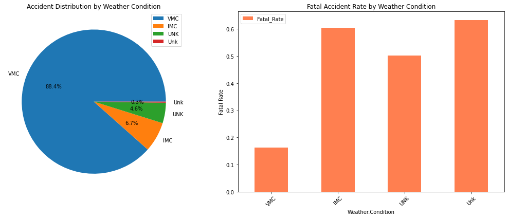
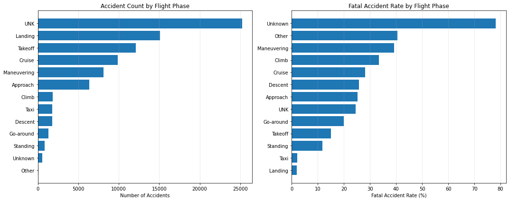

# Aviation Safety Analysis for Aircraft Acquisition Strategy
# Project Overview
This comprehensive Jupyter notebook project conducts an in-depth analysis of aviation safety data to support strategic aircraft acquisition decisions for a company expanding into the aviation industry. The analysis systematically examines historical aviation incident data to identify the safest aircraft models and understand key safety factors.

# Business Context
# Problem Statement
Our company is entering the aviation industry by purchasing and operating aircraft for commercial and private enterprises. As a new player with limited aviation expertise, we need to identify the lowest-risk aircraft options to minimize safety incidents and financial liabilities.

# Key Objectives
Identify aircraft models with the best safety records

Understand factors influencing aviation safety

Provide data-driven recommendations for aircraft acquisition

Develop risk mitigation strategies for operations

# Success Metrics
Low fatal accident rates

High survival rates in incidents

Proven operational reliability

Maintenance and support availability

# Dataset Analysis
*** Dataset Overview ***
File: Aviation_Data.csv

Size: 90,348 records × 31 columns

Time Span: 1948-10-24 to 2022-12-29 (74 years of data)

Primary Focus: United States aviation incidents

Key Data Columns
Incident Information
Event.Id, Investigation.Type, Accident.Number, Event.Date

Location, Country, Latitude, Longitude

Airport.Code, Airport.Name

Aircraft Details
Make, Model, Registration.Number

Aircraft.Category, Aircraft.damage

Number.of.Engines, Engine.Type

Safety Metrics
Injury.Severity

Total.Fatal.Injuries, Total.Serious.Injuries

Total.Minor.Injuries, Total.Uninjured

Operational Context
Purpose.of.flight (Primarily "Personal" flights)

Weather.Condition (VMC, IMC, UNK)

Broad.phase.of.flight (Cruise, Approach, Unknown, etc.)

Report.Status, Publication.Date

Data Quality Assessment
The analysis reveals significant data completeness challenges:

High Missing Values (>40%)
Latitude/Longitude: ~62% missing

Aircraft.Category: ~64% missing

FAR.Description: ~65% missing

Schedule: ~86% missing

Air.carrier: ~82% missing

Moderate Missing Values (5-40%)
Injury data: 14-15% missing for various injury types

Weather.Condition: ~7% missing

Broad.phase.of.flight: ~32% missing

Well-Populated Fields (<5% missing)
Core identifiers: Event.Id, Investigation.Type, Event.Date

Basic aircraft information: Make, Model

Location data: Location, Country

# Technical Implementation
Libraries Used
pandas: Data manipulation and analysis

numpy: Numerical computations

matplotlib: Data visualization

datetime: Date processing

warnings: Management of system warnings

# Current Analysis Status
The notebook currently includes:

Data Loading & Initial Exploration

Dataset shape and structure examination

Date range analysis

Column overview and data types

Data Quality Assessment

Comprehensive missing values analysis

Data type verification

Initial data distribution examination

Preliminary Observations

Dataset dominated by personal flight incidents

United States-focused data

Significant historical coverage (1948-2022)

# Key Insights from Initial Analysis
*** Data Characteristics ***
Large-scale dataset with 90,000+ incidents over 74 years

Geographic focus primarily on United States aviation

Flight purpose predominantly personal aviation

Data completeness varies significantly across columns

# Potential Analysis Directions
Safety trends over time (1948-2022)

Aircraft manufacturer safety comparisons

Weather condition impact on safety

Flight phase risk analysis

Geographic safety patterns

# Next Steps for Analysis
Immediate Priorities
Data Cleaning & Preprocessing

Handle missing values strategically

Standardize data formats

Filter and validate critical safety metrics

Safety Metric Development

Calculate accident rates per aircraft model

Develop survival rate metrics

Create risk scoring system

Advanced Analysis

Statistical modeling of safety factors

Time-series analysis of safety trends

Comparative aircraft model analysis

Strategic Applications\

Aircraft acquisition recommendations

Risk assessment frameworks

Safety improvement strategies

Operational best practices

Usage Instructions
# Prerequisites: Python with pandas, numpy, matplotlib

# Data Setup: Place Aviation_Data.csv in working directory

# Execution: Run Jupyter notebook cells sequentially

# Customization: Modify analysis parameters as needed for specific acquisition scenarios

# Visualizations:

# Link to tableau
https://public.tableau.com/app/profile/jeffrey.gathigi/viz/project1presentation/Dashboard1?publish=yes

# Value Proposition
This analysis provides evidence-based insights to support multi-million dollar aircraft acquisition decisions,
potentially saving significant costs through improved safety outcomes and reduced liability exposure.
